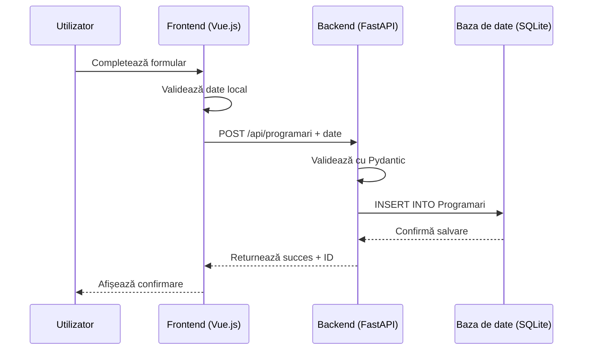
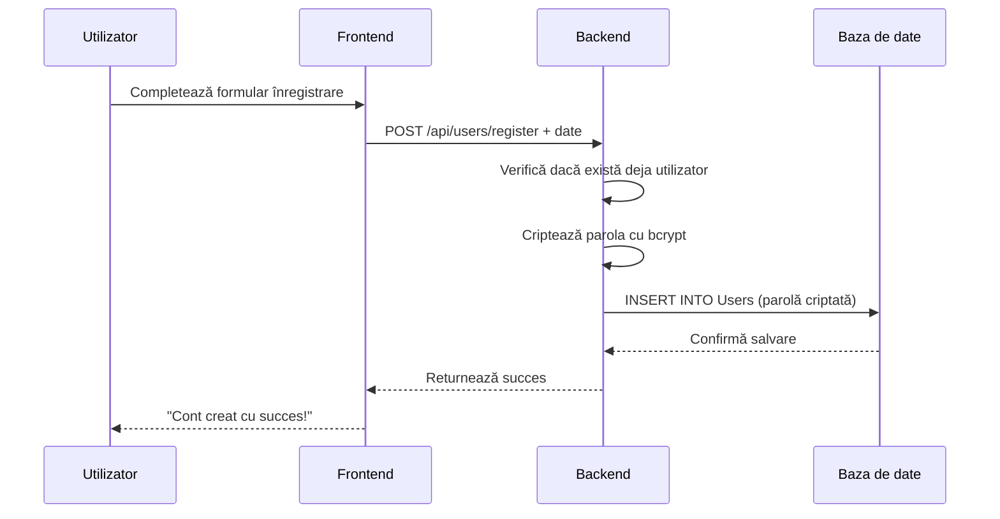
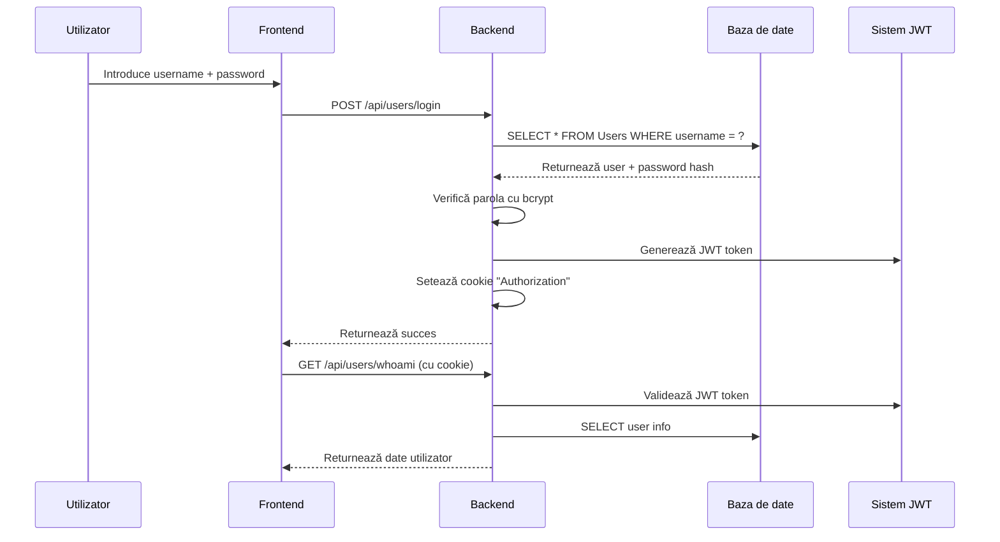
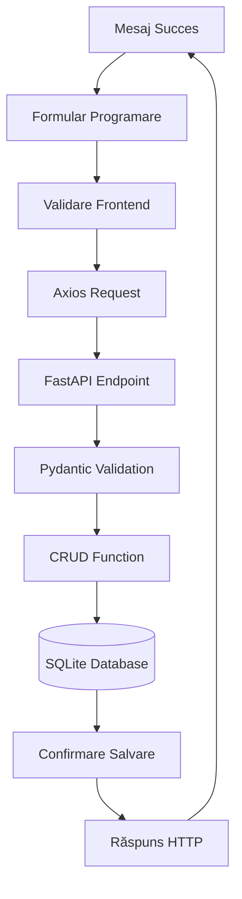

# 📚 Teoria Programării Web - Cum Funcționează Aplicația de Programări

Bun venit în ghidul teoretic! Aici vom explora cum funcționează fiecare componentă a aplicației, de la baza de date până la interfața utilizator. Gândește-te la acest ghid ca la cartea de instrucțiuni a aplicației noastre! 📖

---

## 🏗️ **Arhitectura Generală - Cum Se Asamblează Totul**

Imaginează-ți că construcția unei aplicații web e ca și cum ai construi o clădire:

```
🏢 Clădirea (Aplicația completă)
│
├── 🏠 Fundamentul (Baza de date SQLite)
├── 🏗️ Structura (Backend FastAPI + Tortoise ORM)
├── 🪟 Fațada (Frontend Vue.js)
├── 🔐 Ușa de intrare (Sistem de autentificare)
└── 🛣️ Căile de acces (API endpoints)
```

**Ordinea construcției:**
1. **Baza de date** → Stocăm informațiile
2. **Backend** → Logică de business și API
3. **Frontend** → Interfața pentru utilizatori
4. **Comunicare** → Legătura între frontend și backend

---

## 💾 **Baza de Date SQLite - Biblioteca noastră de informații**

### **Ce este o bază de date?**
O bază de date este ca o bibliotecă organizată unde stocăm informațiile în mod structurat.

**Analogia bibliotecii:**
- **Tabele** = Rafturi de cărți (Persoane, Servicii, Programări)
- **Rânduri** = Cărți individuale (înregistrări specifice)
- **Coloane** = Informații despre fiecare carte (nume, prenume, data, etc.)

### **Tabelele noastre:**

#### **1. Tabela `Users` - Utilizatorii sistemului**
```python
# db/models.py
class Users(Model):
    id = fields.IntField(pk=True)                    # ID unic (index)
    username = fields.CharField(max_length=50, unique=True)  # Nume utilizator
    password = fields.CharField(max_length=200)      # Parola criptată
    email = fields.CharField(max_length=200, unique=True)    # Email
    created_at = fields.DatetimeField(auto_now_add=True)      # Data creare
```

**Rol:** Gestionează cine se poate loga în sistem
**Exemplu de utilizare:** Când te înregistrezi, datele tale se salvează aici

#### **2. Tabela `Persoane` - Clienții noștri**
```python
class Persoane(Model):
    id = fields.IntField(pk=True)                    # ID unic
    nume = fields.CharField(max_length=100)         # Nume de familie
    prenume = fields.CharField(max_length=100)      # Prenume
```

**Rol:** Stochează informațiile despre persoanele pentru care facem programări
**Exemplu de utilizare:** "Popescu Ion" este o persoană înregistrată

#### **3. Tabela `Servicii` - Serviciile oferite**
```python
class Servicii(Model):
    id = fields.IntField(pk=True)                    # ID unic
    descriere = fields.CharField(max_length=200)     # Descrierea serviciului
```

**Rol:** Definește ce servicii oferim (consultații, tratamente, etc.)
**Exemplu de utilizare:** "Consultație generală - 150 RON"

#### **4. Tabela `Programari` - Programările efective**
```python
class Programari(Model):
    id = fields.IntField(pk=True)                    # ID unic
    data = fields.CharField(max_length=50)           # Data programării
    ora = fields.CharField(max_length=10)           # Ora programării
    nume = fields.CharField(max_length=100)         # Nume client
    prenume = fields.CharField(max_length=100)       # Prenume client
    email = fields.CharField(max_length=200)         # Email client
    telefon = fields.CharField(max_length=20)        # Telefon client
    observatii = fields.CharField(max_length=500)    # Note suplimentare
    persoana = fields.ForeignKeyField('models.Persoane')  # Legătura cu persoana
    serviciu = fields.ForeignKeyField('models.Servicii')  # Legătura cu serviciul
```

**Rol:** Stochează programările efective cu toate detaliile
**Exemplu de utilizare:** "Popescu Ion - 2024-12-25 - 14:30 - Consultație"

### **Legăturile între tabele (Relații):**
```python
# O programare aparține unei persoane
programare.persoana = persoana_x

# O programare folosește un serviciu
programare.serviciu = serviciu_y

# Foreign Keys ne permit să aflăm detalii:
# programare.persoana.nume = "Popescu"
# programare.serviciu.descriere = "Consultație generală"
```

**Metafora relațiilor:** Gândește-te la legături ca la note de subsol într-o carte - îți spun unde să cauți informații suplimentare.

---

## 🐍 **Backend FastAPI - Creierul minții al aplicației**

### **Ce face backend-ul?**
Backend-ul este creierul minții care ia decizii, procesează informațiile și răspunde la cereri. E ca un bibliotecar care știe unde se găsesc toate cărțile și cum să le acceseze.

### **Componentele principale:**

#### **1. Main.py - Recepționerul principal**
```python
# main.py - Punctul de intrare al aplicației
from fastapi import FastAPI

app = FastAPI(title="Sistem Programări")

@app.get("/")  # Răspunde la vizite pe pagina principală
async def root():
    return {"message": "Bun venit la sistemul de programări"}

@app.get("/api/programari")  # Returnează toate programările
async def get_programari():
    # Apelează funcția CRUD
    return await get_programari_list()
```

**Rol:** Definește ce "drumuri" (endpoints) sunt disponibile
**Cum funcționează:** Când frontend-ul cere `http://localhost:5000/api/programari`, această funcție răspunde

#### **2. CRUD Operations - Operațiile de bază**
**CRUD** = **C**reate, **R**ead, **U**pdate, **D**elete

```python
# crud/programari.py - Gestionarea programărilor

# CREATE - Creare programare nouă
async def create_programare(programare_data):
    """Creează o programare nouă în baza de date"""
    programare = await Programari.create(
        data=programare_data.data,
        ora=programare_data.ora,
        nume=programare_data.nume
    )
    return programare

# READ - Citire programări
async def get_programari():
    """Returnează toate programările"""
    return await Programari.all()

# UPDATE - Actualizare programare
async def update_programare(programare_id, update_data):
    """Modifică o programare existentă"""
    programare = await Programari.get(id=programare_id)
    programare.update_from_dict(update_data)
    await programare.save()
    return programare

# DELETE - Ștergere programare
async def delete_programare(programare_id):
    """Șterge o programare"""
    programare = await Programari.get(id=programare_id)
    await programare.delete()
    return True
```

**Rol:** Gestionează operațiile directe cu baza de date
**Cum se apelează:** Funcțiile din API endpoints apelează aceste funcții CRUD

#### **3. API Routes - Drumurile de comunicare**
```python
# routes/programari.py - Definește cum accesează frontend-ul funcționalitățile

router = APIRouter()

@router.post("/programari")  # Creare programare nouă
async def create_new_programare(programare: ProgramareInSchema):
    # 1. Primește date de la frontend
    # 2. Le validează
    # 3. Apelează funcția CRUD
    new_programare = await create_programare(programare.dict())

    return {"message": "Programare creată cu succes"}

@router.get("/programari/{programare_id}")  # Caută o programare specifică
async def get_programare_by_id(programare_id: int):
    # Caută programarea după ID
    programare = await Programari.get_or_none(id=programare_id)

    if not programare:
        raise HTTPException(status_code=404, detail="Programare inexistentă")

    return programare
```

**Rol:** Definește "adresele" pe care le poate accesa frontend-ul
**Cum funcționează:** Frontend-ul face request HTTP la aceste adrese

#### **4. Schemas - Validarea datelor**
```python
# schemas/programari.py - Definește cum arată datele valide

class ProgramareInSchema(BaseModel):
    """Definște cum arată datele primite pentru creare programare"""
    data: str          # Ex: "2024-12-25"
    ora: str           # Ex: "14:30"
    nume: str          # Ex: "Popescu"
    prenume: str       # Ex: "Ion"
    email: str         # Opțional
    telefon: str       # Opțional

    @validator('data')
    def validate_date(cls, v):
        """Verifică dacă data e în format corect și nu e în trecut"""
        try:
            data_obj = datetime.strptime(v, '%Y-%m-%d').date()
            if data_obj < datetime.now().date():
                raise ValueError('Data nu poate fi în trecut')
        except ValueError:
            raise ValueError('Format invalid. Folosiți YYYY-MM-DD')
        return v
```

**Rol:** Verifică că datele primite sunt corecte înainte de a le procesa
**Cum funcționează:** Fiecare request prin API este validat de schema corespunzătoare

#### **5. Authentication - Securitatea sistemului**
```python
# auth/users.py - Gestionarea utilizatorilor

def verify_password(plain_password, hashed_password):
    """Verifică dacă parola introdusă se potrivește cu cea criptată"""
    return pwd_context.verify(plain_password, hashed_password)

def get_password_hash(password):
    """Transformă parola în formă criptată"""
    return pwd_context.hash(password)
    # Parola: "parola123" → "$2b$12$x..."
```

**Rol:** Asigură că doar utilizatorii autorizați pot accesa anumite funcționalități
**Cum funcționează:** La login, parola este verificată; la creare, este criptată

---

## 🎨 **Frontend Vue.js - Fațada aplicației**

### **Ce face frontend-ul?**
Frontend-ul este fațada vizibilă a aplicației - ceea ce utilizatorii văd și cu care interacționează. E ca interfața prietenoasă a unei biblioteci care te ajută să găsești rapid ce ai nevoie.

### **Componentele principale:**

#### **1. Vue Components - Cărămizile interfeței**
```vue
<!-- ProgramariView.vue - Pagina principală de programări -->
<template>
  <div class="programari-view">
    <h2>📋 Lista Programărilor</h2>

    <!-- Afișează programările -->
    <ProgramariTable :programari="programari" />

    <!-- Formular pentru adăugare programare nouă -->
    <ProgramariForm @programare-adaugata="incarcaProgramari" />
  </div>
</template>

<script>
export default {
  name: 'ProgramariView',
  data() {
    return {
      programari: []  // Stochează lista de programări
    }
  },
  async created() {
    // Când componenta se încarcă, încarcă programările
    await this.incarcaProgramari()
  },
  methods: {
    async incarcaProgramari() {
      // Apelează API pentru a obține programările
      const response = await axios.get('/api/programari')
      this.programari = response.data
    }
  }
}
</script>
```

**Rol:** Construiește interfața vizuală pe care o vede utilizatorul
**Cum funcționează:** Vue.js transformă template-ul HTML în pagină web interactivă

#### **2. Componenta de Tabel - Afișarea datelor**
```vue
<!-- ProgramariTable.vue - Afișează programările într-un tabel -->
<template>
  <table class="appointments-table">
    <thead>
      <tr>
        <th>Data</th>
        <th>Ora</th>
        <th>Nume</th>
        <th>Serviciu</th>
        <th v-if="currentUser" class="actions">Acțiuni</th>
      </tr>
    </thead>
    <tbody>
      <!-- Iterează prin fiecare programare și o afișează -->
      <tr v-for="programare in programari" :key="programare.id">
        <td>{{ programare.data }}</td>
        <td>{{ programare.ora }}</td>
        <td>{{ programare.nume }} {{ programare.prenume }}</td>
        <td>{{ getServiciu(programare.serviciu_id) }}</td>

        <!-- Butoane de acțiune pentru utilizatori autentificați -->
        <td v-if="currentUser">
          <button @click="editProgramare(programare)">✏️ Editează</button>
          <button @click="deleteProgramare(programare.id)">🗑️ Șterge</button>
        </td>
      </tr>
    </tbody>
  </table>
</template>

<script>
export default {
  props: {
    programari: Array  // Primește programările de la componenta părinte
  },
  methods: {
    async deleteProgramare(programareId) {
      // Confirmare și apoi șterge
      if (confirm('Ești sigur că vrei să ștergi această programare?')) {
        await axios.delete(`/api/programari/${programareId}`)
        this.$emit('programare-stearsa')  // Notifică componenta părinte
      }
    }
  }
}
</script>
```

**Rol:** Afișază datele într-un format organizat și ușor de citit
**Cum funcționează:** Transformă array-ul de date în tabel HTML interactiv

#### **3. Componenta de Formular - Colectarea datelor**
```vue
<!-- ProgramariForm.vue - Formular pentru adăugare programări -->
<template>
  <form @submit.prevent="trimiteProgramare">
    <div class="form-group">
      <label>Data *</label>
      <input
        v-model="programare.data"
        type="date"
        :min="todayDate"
        required
      >
    </div>

    <div class="form-group">
      <label>Ora *</label>
      <input v-model="programare.ora" type="time" required>
    </div>

    <div class="form-group">
      <label>Nume *</label>
      <input v-model="programare.nume" type="text" required>
    </div>

    <button type="submit">Adaugă Programare</button>
  </form>
</template>

<script>
export default {
  data() {
    return {
      programare: {
        data: '',
        ora: '',
        nume: '',
        prenume: '',
        email: '',
        telefon: ''
      }
    }
  },
  methods: {
    async trimiteProgramare() {
      try {
        // Trimite datele către backend
        const response = await axios.post('/api/programari', this.programare)

        // Notifică componenta părinte că s-a adăugat o programare
        this.$emit('programare-adaugata')

        // Resetează formularul
        this.resetForm()

      } catch (error) {
        console.error('Eroare:', error)
      }
    }
  }
}
</script>
```

**Rol:** Colectează date de la utilizator și le trimite către backend
**Cum funcționează:** v-model face legătura dublă între formular și data object

#### **4. Router - Navigarea între pagini**
```javascript
// router/index.js - Definește paginile aplicației
import { createRouter, createWebHistory } from 'vue-router'
import ProgramariView from '../views/ProgramariView.vue'
import LoginView from '../views/LoginView.vue'

const routes = [
  {
    path: '/',                    // http://localhost:8080/
    name: 'home',
    component: () => import('../views/HomeView.vue')
  },
  {
    path: '/programari',          // http://localhost:8080/programari
    name: 'programari',
    component: ProgramariView
  },
  {
    path: '/login',              // http://localhost:8080/login
    name: 'login',
    component: LoginView
  }
]

const router = createRouter({
  history: createWebHistory(),
  routes
})

export default router
```

**Rol:** Gestionează navigarea între diferite pagini ale aplicației
**Cum funcționează:** Când dai click pe un link, Vue Router schimbă componenta afișată fără a reîncărca pagina

---

## 🔗 **Comunicarea Frontend-Backend - Podul dintre lumi**

### **Cum comunică componentele?**

#### **1. Request-Response Cycle**


#### **2. Exemplu complet de comunicare**
```javascript
// Frontend: Trimitere date
async adaugaProgramare() {
  const programareData = {
    data: '2024-12-25',
    ora: '14:30',
    nume: 'Popescu',
    prenume: 'Ion',
    email: 'ion.popescu@email.com',
    telefon: '0723123456'
  }

  try {
    // Trimite HTTP POST către backend
    const response = await axios.post('/api/programari', programareData)

    // Backend va procesa:
    // 1. Validare date (Pydantic)
    // 2. Salvare în baza de date (Tortoise ORM)
    // 3. Returnare răspuns

    console.log('Programare creată cu ID:', response.data.id)

  } catch (error) {
    // Gestionare erori (422, 500, etc.)
    console.error('Eroare:', error.response?.data?.detail)
  }
}
```

```python
# Backend: Primire și procesare date
@router.post("/programari")
async def create_new_programare(programare: ProgramareInSchema):
    """
    Primește date validată și o salvează în baza de date
    """
    # 1. Datele sunt deja validate de ProgramareInSchema
    # 2. Transformăm în dicționar pentru ORM
    programare_dict = programare.dict()

    # 3. Salvăm în baza de date
    new_programare = await Programari.create(**programare_dict)

    # 4. Returnăm răspuns
    return {
        "message": "Programare creată cu succes",
        "id": new_programare.id,
        "data": new_programare.data,
        "ora": new_programare.ora
    }
```

---

## 🔐 **Sistemul de Autentificare - Controlul accesului**

### **Cum funcționează login-ul?**

#### **1. Procesul de înregistrare**


#### **2. Procesul de login**


#### **3. Protejarea endpoint-urilor**
```python
# Endpoint protejat - necesită autentificare
@router.delete("/programari/{programare_id}")
async def delete_programare(
    programare_id: int,
    current_user: Users = Depends(get_current_user)  # <- Protecție!
):
    """
    Doar utilizatorii autentificați pot șterge programări
    """
    # get_current_user() verifică JWT token din cookie
    # Dacă token-ul e invalid sau lipsește, returnează 401 Unauthorized

    programare = await Programari.get(id=programare_id)
    if not programare:
        raise HTTPException(status_code=404, detail="Programare inexistentă")

    await programare.delete()
    return {"message": "Programare ștearsă"}
```

---

## 📊 **Fluxul Complet al Datelor - O călătorie completă**

### **Exemplu complet: Creare unei programări**



#### **Codul care face acest lucru posibil:**

**Frontend (Vue.js):**
```vue
<template>
  <form @submit.prevent="adaugaProgramare">
    <input v-model="programare.data" type="date" required>
    <input v-model="programare.ora" type="time" required>
    <input v-model="programare.nume" type="text" required>
    <button type="submit">Adaugă Programare</button>
  </form>
</template>

<script>
export default {
  methods: {
    async adaugaProgramare() {
      // Pas 1: Validare locală (opțional)
      if (!this.programare.data || !this.programare.ora) {
        alert('Data și ora sunt obligatorii')
        return
      }

      // Pas 2: Trimitere către backend
      try {
        const response = await axios.post('/api/programari', this.programare)

        // Pas 8: Feedback utilizator
        alert('Programare adăugată cu succes!')

      } catch (error) {
        alert('Eroare: ' + error.response?.data?.detail)
      }
    }
  }
}
</script>
```

**Backend (FastAPI):**
```python
@router.post("/programari")
async def create_new_programare(programare: ProgramareInSchema):
    """
    Primește programare validată și o salvează
    """
    # Pas 3: Validare Pydantic (automată)
    # Pas 4: Pregătire date
    programare_dict = programare.dict()

    try:
        # Pas 5: Salvare în baza de date
        new_programare = await Programari.create(**programare_dict)

        # Pas 6: Pregătire răspuns
        response_data = {
            "message": "Programare creată cu succes",
            "id": new_programare.id,
            "data": new_programare.data,
            "ora": new_programare.ora
        }

        # Pas 7: Returnare răspuns
        return response_data

    except Exception as e:
        # Gestionare erori
        raise HTTPException(status_code=500, detail=f"Eroare: {str(e)}")
```

**Database (SQLite):**
```python
# Tortoise ORM transformă Python objects în SQL queries
# Programari.create(**programare_dict) devine:

"""
INSERT INTO Programari (
    data, ora, nume, prenume, email, telefon,
    observatii, persoana_id, serviciu_id, created_at
) VALUES (
    '2024-12-25', '14:30', 'Popescu', 'Ion', 'email@example.com', '0723123456',
    NULL, NULL, 1, datetime('now')
);
"""
```

---

## 🎯 **Rolul Fiecarei Componente - Rezumat**

### **1. Database (SQLite)**
- **Rol:** Bibliotecă de informații persistente
- **Ce face:** Stochează și recuperează date structurate
- **Cum funcționează:** SQL queries prin Tortoise ORM

### **2. Backend (FastAPI)**
- **Rol:** Creierul minții al aplicației
- **Ce face:** Procesează logică de business, validează date, gestionează securitatea
- **Cum funcționează:** HTTP endpoints care răspund la request-uri

### **3. Frontend (Vue.js)**
- **Rol:** Interfața vizibilă pentru utilizatori
- **Ce face:** Afișează date, colectează input utilizatori, gestionează interacțiuni
- **Cum funcționează:** Components reactive cu data binding

### **4. API (Application Programming Interface)**
- **Rol:** Pod de comunicare între frontend și backend
- **Ce face:** Definește cum comunica componentele
- **Cum funcționează:** HTTP requests/responses cu JSON

### **5. Authentication (JWT)**
- **Rol:** Sistem de securitate
- **Ce face:** Verifică identitatea utilizatorilor, protejează resurse
- **Cum funcționează:** Token-uri criptate în cookie-uri securizate

---

## 🔧 **Cum se întâmplă totul în practică**

### **Exemplu real - Un utilizator adaugă o programare:**

1. **Utilizatorul deschide pagina** → Vue Router încarcă `ProgramariView.vue`
2. **Completează formularul** → `v-model` leagă input-ul de data object
3. **Apasă "Adaugă"** → `@submit.prevent` previne refresh și apelează funcția
4. **Frontend trimite date** → `axios.post('/api/programari', data)`
5. **Backend primește request** → FastAPI route `/programari`
6. **Validare Pydantic** → Verifică formatul datelor
7. **Salvare în database** → Tortoise ORM creează înregistrare
8. **Răspuns la frontend** → JSON cu status și date
9. **Actualizare UI** → Vue.js actualizează lista de programări
10. **Feedback utilizator** → Mesaj de succes sau eroare

---

## 💡 **Principii de Design Importante**

### **1. Separation of Concerns**
Fiecare componentă are o singură responsabilitate clară:
- **Database** = Stochează date
- **Backend** = Procesează logică
- **Frontend** = Afișează interfață

### **2. Data Flow Unidirecțional**
Datele curg într-o singură direcție:
```
User Input → Frontend → Backend → Database
           ↑          ↓
         Response  ← Backend ← Database
```

### **3. Validation at Multiple Levels**
- **Frontend:** Validare rapidă pentru UX
- **Backend:** Validare riguroasă pentru securitate
- **Database:** Constraints pentru integritate

### **4. Error Handling**
Fiecare nivel gestionează erorile corespunzător:
```javascript
// Frontend error handling
try {
  const response = await axios.post('/api/programari', data)
} catch (error) {
  if (error.response?.status === 422) {
    // Eroare de validare
  } else if (error.response?.status === 500) {
    // Eroare de server
  }
}
```

---

## 🚀 **Ce înveți din această arhitectură?**

### **Concepte Fundamentale:**
1. **Database Design** - Cum structurezi informațiile
2. **API Design** - Cum expui funcționalități
3. **Frontend Architecture** - Cum organizezi UI components
4. **Authentication** - Cum securizezi aplicația
5. **Error Handling** - Cum gestionezi problemele

### **Tehnologii Acoperite:**
- **SQLite/Tortoise ORM** - Baze de date
- **FastAPI** - Python web framework
- **Vue.js** - JavaScript frontend framework
- **Axios** - HTTP client library
- **JWT/Bcrypt** - Security

### **Best Practices:**
- **Validation** la mai multe niveluri
- **Separation of concerns** în arhitectură
- **Error handling** robust
- **Code organization** modulară

---

## 🎓 **Următorii pași pentru tine**

1. **Înțelege fluxul** - Studiază cum comunică componentele
2. **Experimentează** - Modifică codul și vezi ce se întâmplă
3. **Adaugă funcționalități** - Implementează noi features
4. **Optimizează** - Îmbunătățește performanța și UX
5. **Deploy** - Publică aplicația pentru utilizatori reali

**Felicitări!** Acum înțelegi cum funcționează o aplicație web completă, de la baza de date până la interfața utilizator. Fiecare componentă are un rol specific și important în arhitectura generală! 🎉

**Amintește:** Programarea e ca și cum ai construi cu LEGO - fiecare piesă are un rol specific, și împreună creează ceva minunat! 🧱