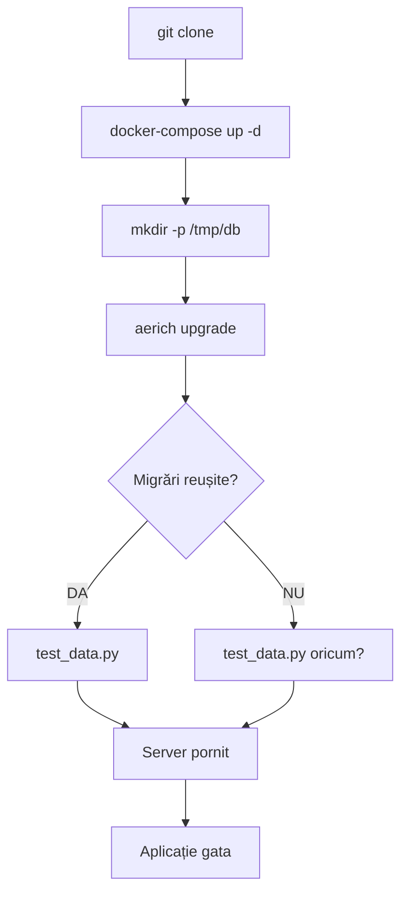

# 🔗 Aerich Legături Complete - Setup Automat pentru Colegi

## ⚠️ **PROBLEMĂ CRITICĂ: Configurație Inconsistentă**

**NU MODIFICA CODUL FĂRĂ PERMIȘIUNE** - Documentarea este doar explicativă!

### Problema detectată:
**docker-compose.yml** folosește `aerich upgrade` dar configurația **pyproject.toml** are `location = "./migrations"` în timp ce migrările sunt în `./migrations/models/`

**Cum ar trebui să fie:**
```toml
[tool.aerich]
tortoise_orm = "db.config.TORTOISE_ORM"
location = "./migrations/models"  # <-- CORECT: unde sunt fișierele de migrări
src_folder = "./."
```

---

## 🚀 **Workflow-ul Actual (cu problema de configurație)**

Când un coleg nou clonează și rulează `docker-compose up -d`:

### **Pasul 1: Comanda Docker Compose**
```yaml
# docker-compose.yml (liniile 15-21)
command: >
  sh -c "
  mkdir -p /tmp/db &&
  aerich upgrade &&                     # ⚠️ PROBLEMĂ: cale greșită în pyproject.toml
  python migrations/test_data.py &&    # ✅ Funcționează: adaugă date de test
  uvicorn src.main:app --reload --host 0.0.0.0 --port 5000
  "
```

### **Pasul 2: Ce se execută de fapt**

**2.1. `mkdir -p /tmp/db`**
- Creează directorul pentru baza de date
- Path: `/tmp/db/` (în container)

**2.2. `aerich upgrade`**
- **Încearcă** să aplice migrările din `./migrations` (config pyproject.toml)
- **Realitatea**: migrările sunt în `./migrations/models/`
- **Rezultat actual**: Probabil eșuează sau nu găsește migrările

**2.3. `python migrations/test_data.py`**
- Acest script **funcționează** pentru că e chemat direct
- Adaugă datele de test direct cu Tortoise ORM
- **DEPINDE** de tabelele care ar trebui create de migrări

---

## 🔍 **Analiza Detaliată a Componentelor**

### **1. Migrările Aerich (`migrations/models/`)**

#### **Fișierul principal:** `1_20251103141033_None.py`
```python
# Creează toate tabelele:
CREATE TABLE "Job" (
    "id" INTEGER PRIMARY KEY AUTOINCREMENT,
    "nume" VARCHAR(100) NOT NULL UNIQUE,
    "created_at" TIMESTAMP DEFAULT CURRENT_TIMESTAMP,
    "updated_at" TIMESTAMP DEFAULT CURRENT_TIMESTAMP
);

CREATE TABLE "Persoane" (
    "id" INTEGER PRIMARY KEY AUTOINCREMENT,
    "nume" VARCHAR(100) NOT NULL,
    "prenume" VARCHAR(100) NOT NULL,
    "email" VARCHAR(200) UNIQUE,
    "telefon" VARCHAR(50),
    "created_at" TIMESTAMP DEFAULT CURRENT_TIMESTAMP,
    "updated_at" TIMESTAMP DEFAULT CURRENT_TIMESTAMP,
    "job_id" INT REFERENCES "Job" ("id") ON DELETE SET NULL
);

CREATE TABLE "Servicii" (
    "id" INTEGER PRIMARY KEY AUTOINCREMENT,
    "descriere" VARCHAR(255) NOT NULL,
    "durata_min" INT DEFAULT 30,
    "pret" VARCHAR(40),
    "created_at" TIMESTAMP DEFAULT CURRENT_TIMESTAMP,
    "updated_at" TIMESTAMP DEFAULT CURRENT_TIMESTAMP,
    "job_id" INT REFERENCES "Job" ("id") ON DELETE SET NULL
);

CREATE TABLE "Programari" (
    "id" INTEGER PRIMARY KEY AUTOINCREMENT,
    "data" DATE NOT NULL,
    "ora" TIME NOT NULL,
    "observatii" TEXT,
    "nume_client" VARCHAR(100),
    "prenume_client" VARCHAR(100),
    "email_client" VARCHAR(200),
    "telefon_client" VARCHAR(50),
    "status" VARCHAR(20) DEFAULT 'pending',
    "created_at" TIMESTAMP DEFAULT CURRENT_TIMESTAMP,
    "updated_at" TIMESTAMP DEFAULT CURRENT_TIMESTAMP,
    "job_id" INT REFERENCES "Job" ("id") ON DELETE SET NULL,
    "persoana_id" INT REFERENCES "Persoane" ("id") ON DELETE SET NULL,
    "serviciu_id" INT REFERENCES "Servicii" ("id") ON DELETE SET NULL
);

CREATE TABLE "Users" (
    "id" INTEGER PRIMARY KEY AUTOINCREMENT,
    "username" VARCHAR(50) NOT NULL UNIQUE,
    "password" VARCHAR(200) NOT NULL,
    "email" VARCHAR(200) NOT NULL UNIQUE,
    "role" VARCHAR(20) DEFAULT 'user',
    "created_at" TIMESTAMP DEFAULT CURRENT_TIMESTAMP,
    "updated_at" TIMESTAMP DEFAULT CURRENT_TIMESTAMP
);

CREATE TABLE "aerich" (
    "id" INTEGER PRIMARY KEY AUTOINCREMENT,
    "version" VARCHAR(255) NOT NULL,
    "app" VARCHAR(100) NOT NULL,
    "content" JSON NOT NULL
);
```

### **2. Scriptul de Date de Test (`migrations/test_data.py`)**

#### **Funcționalități:**
```python
# 1. Verifică dacă există deja date
jobs_count = await Job.all().count()
if jobs_count > 0:
    print(f"Test data already exists, skipping...")
    return

# 2. Creează Job-uri (5 categorii)
job1 = await Job.create(nume='Stomatolog')
job2 = await Job.create(nume='Mecanic Auto')
job3 = await Job.create(nume='Electrician')
job4 = await Job.create(nume='Altele')
job5 = await Job.create(nume='General/Ne-specificat')

# 3. Creează Persoane (5 persoane)
pers1 = await Persoane.create(nume='Popescu', prenume='Ion', job=job1)
# ... etc

# 4. Creează Servicii (9 servicii)
serv1 = await Servicii.create(descriere='Consultatie generala', job=job1)
# ... etc

# 5. Creează relații PersoanaJob (many-to-many)
await PersoanaJob.create(persoana=pers1, job=job1)
# ... etc

# 6. Creează Programări (3 programări sample)
await Programari.create(
    data=tomorrow.isoformat(),
    ora='09:00',
    nume_client='Client Test 1',
    # ... etc
    status='pending'
)

# 7. Creează Utilizatori (3 useri cu parola: 'parola123')
hashed_password = bcrypt.hashpw(password.encode('utf-8'), bcrypt.gensalt()).decode('utf-8')
await Users.create(username='admin', password=hashed_password, role='admin')
```

### **3. Scriptul Manual `apply_migration.py`**

**Rol:** Backup system - aplică manual SQL-ul din migrări
```python
# Cum funcționează:
1. Creează tabela 'aerich' dacă nu există
2. Caută fișiere *.py în /app/migrations/models/
3. Extrage SQL-ul din funcția upgrade() din fiecare fișier
4. Aplică SQL-ul direct în baza de date
5. Înregistrează migrarea în tabela 'aerich'
```

---

## 🔄 **Legăturile dintre Componente**

### **Diagrama fluxului actual:**


### **Problema principală:**
- **Dacă `aerich upgrade` eșuează** → Tabelele nu se creează
- **Dacă tabelele nu există** → `test_data.py` va eșua
- **Rezultat**: Aplicația nu pornește corect

---

## 📋 **Comenzile și Efectele Lor**

### **1. Setup complet (comanda actuală)**
```bash
docker-compose up -d
```

**Ce se execută în container:**
```bash
# Pas 1: Creează director DB
mkdir -p /tmp/db

# Pas 2: Încearcă să aplice migrări
aerich upgrade
# ⚠️ PROBLEMĂ: Cale greșită în pyproject.toml
# location = "./migrations" vs "./migrations/models"

# Pas 3: Adaugă date de test
python migrations/test_data.py
# ✅ FUNCȚIONEAZĂ: Dar doar dacă tabelele există

# Pas 4: Pornește server
uvicorn src.main:app --reload --host 0.0.0.0 --port 5000
```

### **2. Setup manual (dacă cel automat eșuează)**
```bash
# Opțiunea A: Corectează configurarea Aerich
docker-compose exec backend python -c "
import toml
with open('pyproject.toml', 'r') as f:
    config = toml.load(f)
config['tool']['aerich']['location'] = './migrations/models'
with open('pyproject.toml', 'w') as f:
    toml.dump(config, f)
"

# Opțiunea B: Aplică migrările manual
docker-compose exec backend python apply_migration.py

# Opțiunea C: Folosește comenzi directe
docker-compose exec backend python -c "
from tortoise import Tortoise
from db.config import TORTOISE_ORM
await Tortoise.init(config=TORTOISE_ORM)
await Tortoise.generate_schemas()
await Tortoise.close_connections()
"
```

### **3. Verificare status**
```bash
# Verifică dacă tabelele există
docker-compose exec backend python -c "
import sqlite3
conn = sqlite3.connect('/tmp/db/programari.db')
cursor = conn.cursor()
cursor.execute('SELECT name FROM sqlite_master WHERE type=\"table\";')
print('Tabele:', [row[0] for row in cursor.fetchall()])
conn.close()
"

# Verifică dacă datele există
docker-compose exec backend python -c "
import sqlite3
conn = sqlite3.connect('/tmp/db/programari.db')
cursor = conn.cursor()
cursor.execute('SELECT COUNT(*) FROM Job')
print('Job-uri:', cursor.fetchone()[0])
cursor.execute('SELECT COUNT(*) FROM Users')
print('Useri:', cursor.fetchone()[0])
conn.close()
"
```

---

## 🎯 **Cum ar trebui să funcționeze (Corect)**

### **Configurație corectă:**
```toml
# pyproject.toml
[tool.aerich]
tortoise_orm = "db.config.TORTOISE_ORM"
location = "./migrations/models"  # <-- CORECT
src_folder = "./."
```

### **Flux corect:**
```bash
docker-compose up -d
# 1. mkdir -p /tmp/db ✅
# 2. aerich upgrade ✅ (găsește migrările în ./migrations/models/)
# 3. python migrations/test_data.py ✅ (tabelele există)
# 4. uvicorn ✅ (aplicație completă)
```

---

## 🛠️ **Soluții posibile (FĂRĂ a modifica codul)**

### **Pentru colegul nou (workaround):**
```bash
# 1. Clonează repo
git clone <repository-url>
cd Service

# 2. Pornește Docker
docker-compose up -d

# 3. Verifică dacă a funcționat
docker-compose logs backend

# 4. Dacă apar erori de tabele, aplică manual:
docker-compose exec backend python apply_migration.py

# 5. Aplică date de test manual (dacă e necesar)
docker-compose exec backend python migrations/test_data.py

# 6. Verifică funcționalitate
curl http://localhost:5000/jobs
```

### **Comenzi de debugging:**
```bash
# Vezi exact ce se execută
docker-compose logs backend | head -50

# Verifică structura DB
docker-compose exec backend sqlite3 /tmp/db/programari.db ".tables"

# Verifică migrările aplicate
docker-compose exec backend sqlite3 /tmp/db/programari.db "SELECT * FROM aerich;"

# Forțează recreere DB
docker-compose down -v
docker-compose up -d
```

---

## 📝 **Summary**

### **Ce primește colegul:**
1. ✅ **Repository complet** cu cod și documentație
2. ✅ **Docker setup** configurat
3. ✅ **Migrări** pentru schema bazei de date
4. ✅ **Date de test** pentru demonstrație
5. ⚠️ **Configurație inconsistentă** care poate cauza erori

### **Legăturile critice:**
- **`docker-compose.yml`** → Pornește serviciile
- **`aerich upgrade`** → Ar trebui să creeze tabelele
- **`test_data.py`** → Populează cu date demonstrative
- **`uvicorn`** → Pornește server-ul API

### **Punctele de failure:**
1. **`aerich upgrade`** poate eșua din cauza căii greșite în `pyproject.toml`
2. **`test_data.py`** eșuează dacă tabelele nu există
3. **Server-ul** pornește dar API-ul returnează erori dacă DB nu e populat

### **Recomandare:**
**NU se modifică codul fără permisiune**, dar colegul ar trebui să știe de această problemă și cum să o rezolve manual dacă apare.