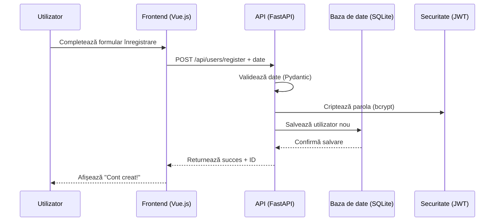
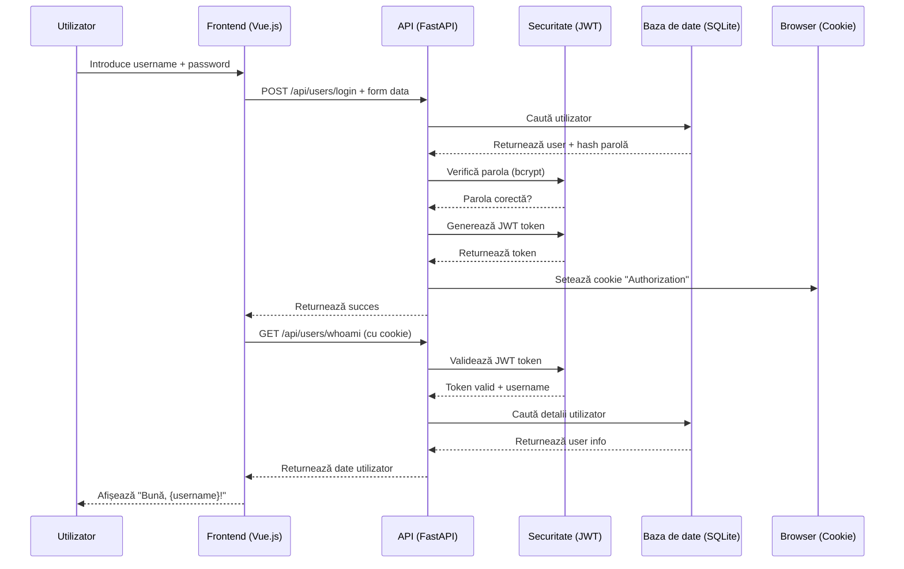
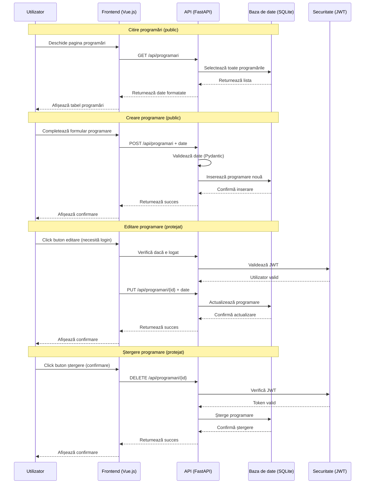
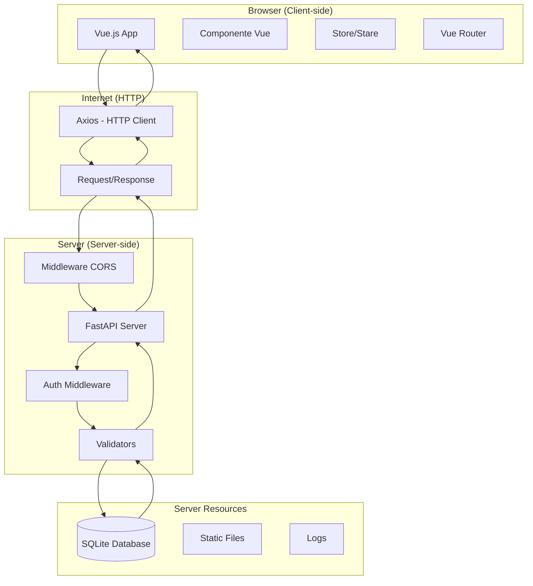

# 📚 Ghidul Arhitecturii pentru Începători - Cum Funcționează Aplicația Noastră

Bun venit în ghidul de arhitectură! Vom explora cum este structurată aplicația de programări, pas cu pas, cu exemple concrete de cod pe care le poți înțelege ușor.

---

## 🏗️ **Structura Generală a Proiectului**

Imaginează-ți că faci o casă cu LEGO. Ai nevoie de cutii diferite pentru piese diferite. La fel și în programare!

```
services/backend/src/
├── auth/           📦 Securitate: Login, parole, token-uri
├── crud/           📦 Baza de date: Adaugă, citește, modifică, șterge
├── routes/         📦 Drumuri (API): Cum accesezi funcționalitățile
├── schemas/        📦 Formulare: Validare date intrare/ieșire
└── main.py         🏠 Clădirea principală: Leagă totul laolaltă
```

**Metafora Casei:**
- `auth/` = Ușa securizată cu yală și cheie
- `crud/` = Depozitul cu bunuri (persoane, programări, servicii)
- `routes/` = Drumețele care te ghidează spre fiecare cameră
- `schemas/` = Formulare de înregistrare la intrare
- `main.py` = Recepționerul care primește toți vizitatorii

---

## 🔐 **Modulele de Securitate (`auth/` - Ușa Casei)**

### **`auth/users.py` - Gardianul Parolelor**

```python
from passlib.context import CryptContext

# Context pentru criptare - ca un seif digital
pwd_context = CryptContext(schemes=["bcrypt"], deprecated="auto")

def get_password_hash(password: str) -> str:
    """
    Criptează parola ca și cum ai pune banii în seif

    Exemplu:
    "parola123" → "$2b$12$EixZaYVK1fsbw1ZfbX3MXe.VePOcXMRqZt7hdKZdVjF8/FrrT.H."
    """
    return pwd_context.hash(password)

def verify_password(plain_password: str, hashed_password: str) -> bool:
    """
    Verifică dacă parola introdusă se potrivește cu cea din seif

    E ca și cum ai introduce cheia în yală și verifică dacă deschide ușa
    """
    return pwd_context.verify(plain_password, hashed_password)

def get_user(username: str):
    """
    Caută utilizator în baza de date

    E ca și cum ai căuta numele pe lista de invitați
    """
    return Users.get_or_none(username=username)

def validate_user(username: str, password: str):
    """
    Proces complet de autentificare

    1. Caută utilizatorul în lista de invitați
    2. Verifică dacă are cheia corectă
    3. Lasă intrarea doar dacă totul e OK
    """
    user = get_user(username)
    if not user:
        return False  # Nu e pe listă

    if not verify_password(password, user.password):
        return False  # Cheia nu se potrivește

    return True  # Totul e OK, poate intra!
```

### **`auth/jwthandler.py` - Sistemul de Acces cu Bilete (JWT)**

```python
from jose import JWTError, jwt
from datetime import datetime, timedelta

# Cheia secretă a sistemului - ca parola principală a clădirii
SECRET_KEY = "cheie_secreta_super_puternica_jwt"
ALGORITHM = "HS256"  # Algoritm de criptare
ACCESS_TOKEN_EXPIRE_MINUTES = 30  # Biletele expiră după 30 minute

def create_access_token(data: dict, expires_delta: timedelta = None):
    """
    Creează un bilet de acces temporar

    E ca și cum ai primi un badge temporar la intrarea în clădire
    """
    to_encode = data.copy()

    if expires_delta:
        expire = datetime.utcnow() + expires_delta
    else:
        expire = datetime.utcnow() + timedelta(minutes=15)

    to_encode.update({"exp": expire})

    # Generează biletul criptat
    encoded_jwt = jwt.encode(to_encode, SECRET_KEY, algorithm=ALGORITHM)
    return encoded_jwt

def get_current_user(token: str = Depends(oauth2_scheme)):
    """
    Verifică biletul de acces

    E ca și cum paznicul verifică badge-ul la fiecare ușă
    """
    try:
        # Decodează biletul
        payload = jwt.decode(token, SECRET_KEY, algorithms=[ALGORITHM])
        username: str = payload.get("sub")

        if username is None:
            raise HTTPException(status_code=401, detail="Bilet invalid")

    except JWTError:
        raise HTTPException(status_code=401, detail="Bilet expirat sau invalid")

    # Caută utilizatorul în baza de date
    user = get_user(username)
    if user is None:
        raise HTTPException(status_code=401, detail="Utilizator inexistent")

    return user

# OAuth2PasswordBearerCookie = Cititor automat de bilete din cookie-uri
```

**💡 Ce înveți de aici?**
- **Criptare**: Cum transformăm date sensibile în forme securizate
- **Token-uri JWT**: Bilete de acces temporare pentru securitate
- **Autentificare**: Procesul de verificare a identității
- **Securitate**: Cum protejăm parolele și accesul la sistem

---

## 🗃️ **Modulele Bazei de Date (`crud/` - Depozitul Casei)**

### **`crud/users.py` - Administratorul Utilizatorilor**

```python
from tortoise.exceptions import IntegrityError

async def create_user(user_data):
    """
    Adaugă un utilizator nou în sistem

    E ca și cum ai înregistra un membru nou în club
    """
    try:
        # Criptează parola înainte de a o salva
        hashed_password = get_password_hash(user_data.password)

        # Creează utilizatorul în baza de date
        user = await Users.create(
            username=user_data.username,
            email=user_data.email,
            password=hashed_password  # Salvăm parola criptată!
        )

        return user

    except IntegrityError:
        # Username sau email deja existent
        raise HTTPException(status_code=400, detail="Username sau email deja folosit")

async def delete_user(user_id: int, current_user):
    """
    Șterge un utilizator (doar propriul cont)

    E ca și cum ți-ai șterge propriul profil din club
    """
    if current_user.id != user_id:
        raise HTTPException(status_code=403, detail="Nu poți șterge contul altuia")

    user = await Users.get_or_none(id=user_id)
    if not user:
        raise HTTPException(status_code=404, detail="Utilizator inexistent")

    await user.delete()
    return True
```

### **`crud/programari.py` - Administratorul Programărilor**

```python
async def create_programare(programare_data):
    """
    Creează o programare nouă

    E ca și cum ai face o rezervare la restaurant
    """
    try:
        # Verifică dacă data și ora sunt în viitor
        data_programare = datetime.strptime(programare_data.data, '%Y-%m-%d').date()
        ora_programare = datetime.strptime(programare_data.ora, '%H:%M').time()
        datetime_actual = datetime.now()

        if data_programare < datetime_actual.date():
            raise ValueError("Data programării nu poate fi în trecut")

        # Creează programarea în baza de date
        programare = await Programari.create(
            data=programare_data.data,
            ora=programare_data.ora,
            nume=programare_data.nume,
            prenume=programare_data.prenume,
            email=programare_data.email,
            telefon=programare_data.telefon,
            observatii=programare_data.observatii,
            persoana_id=programare_data.persoana_id,
            serviciu_id=programare_data.serviciu_id
        )

        return programare

    except ValueError as e:
        raise HTTPException(status_code=400, detail=str(e))
    except Exception as e:
        raise HTTPException(status_code=500, detail=f"Eroare la creare programare: {str(e)}")

async def get_programari():
    """
    Returnează toate programările

    E ca și cum ai vedea lista tuturor rezervărilor din restaurant
    """
    programari = await Programari.all().prefetch_related('persoana', 'serviciu')
    return programari

async def update_programare(programare_id: int, update_data, current_user):
    """
    Actualizează o programare existentă

    E ca și cum ai modifica o rezervare existentă
    """
    programare = await Programari.get_or_none(id=programare_id)

    if not programare:
        raise HTTPException(status_code=404, detail="Programarea nu există")

    # Actualizează doar câmpurile primite
    for field, value in update_data.items():
        if hasattr(programare, field):
            setattr(programare, field, value)

    await programare.save()
    return programare

async def delete_programare(programare_id: int, current_user):
    """
    Șterge o programare

    E ca și cum ai anula o rezervare
    """
    programare = await Programari.get_or_none(id=programare_id)

    if not programare:
        raise HTTPException(status_code=404, detail="Programarea nu există")

    await programare.delete()
    return True
```

**💡 Ce înveți de aici?**
- **CRUD Operations**: Create, Read, Update, Delete - operațiile de bază
- **Baze de date**: Cum interacționăm cu SQLite prin Tortoise ORM
- **Validare date**: Cum verificăm corectitudinea datelor
- **Error Handling**: Cum gestionăm erorile în mod elegant
- **Relații**: Cum lucrăm cu tabele legate între ele

---

## 🛣️ **Modulele de Rutare (`routes/` - Hărțile Casei)**

### **`routes/users.py` - Recepția pentru Utilizatori**

```python
from fastapi import APIRouter, Depends, HTTPException, Response, status
from fastapi.security import OAuth2PasswordRequestForm

# Router - ca o hartă specială pentru utilizatori
router = APIRouter(prefix="/users", tags=["Authentication"])

@router.post("/register")
async def register(user_data: UserInSchema):
    """
    Înregistrare utilizator nou

    Flow-ul:
    1. Utilizatorul completează formularul de înregistrare
    2. Serverul validează datele
    3. Parola se criptează
    4. Utilizatorul se salvează în baza de date
    5. Serverul returnează success
    """
    try:
        # Verifică dacă utilizatorul există deja
        existing_user = await Users.get_or_none(username=user_data.username)
        if existing_user:
            raise HTTPException(status_code=400, detail="Username deja folosit")

        existing_email = await Users.get_or_none(email=user_data.email)
        if existing_email:
            raise HTTPException(status_code=400, detail="Email deja folosit")

        # Creează utilizatorul
        user = await create_user(user_data)

        return {
            "message": "Utilizator creat cu succes",
            "username": user.username,
            "email": user.email
        }

    except HTTPException:
        raise
    except Exception as e:
        raise HTTPException(status_code=500, detail=f"Eroare la înregistrare: {str(e)}")

@router.post("/login")
async def login(response: Response, form_data: OAuth2PasswordRequestForm = Depends()):
    """
    Autentificare utilizator

    Flow-ul:
    1. Utilizatorul trimite username și password
    2. Serverul verifică datele
    3. Dacă sunt corecte, generează un JWT token
    4. Setează un cookie cu token-ul
    5. Returnează mesaj de succes
    """
    try:
        # Validare utilizator
        user = await validate_user(form_data.username, form_data.password)
        if not user:
            raise HTTPException(
                status_code=status.HTTP_401_UNAUTHORIZED,
                detail="Username sau parolă incorectă",
                headers={"WWW-Authenticate": "Bearer"},
            )

        # Creare token de acces
        access_token_expires = timedelta(minutes=ACCESS_TOKEN_EXPIRE_MINUTES)
        access_token = create_access_token(
            data={"sub": user.username}, expires_delta=access_token_expires
        )

        # Setare cookie securizat
        response.set_cookie(
            key="Authorization",
            value=f"Bearer {access_token}",
            httponly=True,      # JavaScript nu poate accesa
            max_age=1800,       # 30 minute
            expires=1800,
            samesite="Lax",     # CSRF protection
        )

        return {
            "access_token": access_token,
            "token_type": "bearer",
            "message": "Login successful",
            "username": user.username
        }

    except HTTPException:
        raise
    except Exception as e:
        raise HTTPException(status_code=500, detail=f"Eroare la login: {str(e)}")

@router.get("/whoami")
async def get_current_user_info(current_user: Users = Depends(get_current_user)):
    """
    Returnează informații despre utilizatorul autentificat

    E ca și cum ai întreba "Cine sunt eu?" și sistemul îți răspunde
    """
    return {
        "id": current_user.id,
        "username": current_user.username,
        "email": current_user.email,
        "created_at": current_user.created_at,
        "modified_at": current_user.modified_at
    }

@router.post("/logout")
async def logout(response: Response):
    """
    Delogare utilizator

    Flow-ul:
    1. Serverul șterge cookie-ul de autentificare
    2. Returnează mesaj de succes
    """
    response.delete_cookie(key="Authorization")
    return {"message": "Logout successful"}
```

### **`routes/programari.py` - Gestionarea Programărilor**

```python
router = APIRouter(prefix="/programari", tags=["Appointments"])

@router.get("/")
async def get_programari_list():
    """
    Returnează lista tuturor programărilor

    Acces public - oricine poate vedea programările
    """
    try:
        programari = await get_programari()

        # Formatăm datele pentru frontend
        result = []
        for prog in programari:
            result.append({
                "id": prog.id,
                "data": prog.data,
                "ora": prog.ora,
                "nume": prog.nume,
                "prenume": prog.prenume,
                "email": prog.email,
                "telefon": prog.telefon,
                "observatii": prog.observatii,
                "persoana_id": prog.persoana_id,
                "serviciu_id": prog.serviciu_id,
                "persoana": {
                    "id": prog.persoana.id,
                    "nume": prog.persoana.nume,
                    "prenume": prog.persoana.prenume
                } if prog.persoana else None,
                "serviciu": {
                    "id": prog.serviciu.id,
                    "descriere": prog.serviciu.descriere
                } if prog.serviciu else None
            })

        return result

    except Exception as e:
        raise HTTPException(status_code=500, detail=f"Eroare la încărcare programări: {str(e)}")

@router.post("/")
async def create_new_programare(programare: ProgramareIn):
    """
    Creează o programare nouă

    Acces public - oricine poate face programări
    """
    try:
        # Validare date
        if not programare.data or not programare.ora:
            raise HTTPException(status_code=400, detail="Data și ora sunt obligatorii")

        # Verificare format dată
        try:
            datetime.strptime(programare.data, '%Y-%m-%d')
        except ValueError:
            raise HTTPException(status_code=400, detail="Format dată invalid. Folosiți YYYY-MM-DD")

        # Verificare format oră
        try:
            datetime.strptime(programare.ora, '%H:%M')
        except ValueError:
            raise HTTPException(status_code=400, detail="Format oră invalid. Folosiți HH:MM")

        # Creează programarea
        new_programare = await create_programare(programare)

        return {
            "message": "Programare creată cu succes",
            "id": new_programare.id,
            "data": new_programare.data,
            "ora": new_programare.ora
        }

    except HTTPException:
        raise
    except Exception as e:
        raise HTTPException(status_code=500, detail=f"Eroare la creare programare: {str(e)}")

@router.put("/{programare_id}")
async def update_appointment(programare_id: int, programare: ProgramareIn, current_user: Users = Depends(get_current_user)):
    """
    Actualizează o programare existentă

    DOAR pentru utilizatori autentificați!
    """
    try:
        # Verificare dacă programarea există
        existing_programare = await Programari.get_or_none(id=programare_id)
        if not existing_programare:
            raise HTTPException(status_code=404, detail="Programarea nu există")

        # Actualizează programarea
        updated_programare = await update_programare(programare_id, programare.dict(), current_user)

        return {
            "message": "Programare actualizată cu succes",
            "id": updated_programare.id
        }

    except HTTPException:
        raise
    except Exception as e:
        raise HTTPException(status_code=500, detail=f"Eroare la actualizare programare: {str(e)}")

@router.delete("/{programare_id}")
async def delete_appointment(programare_id: int, current_user: Users = Depends(get_current_user)):
    """
    Șterge o programare

    DOAR pentru utilizatori autentificați!
    """
    try:
        # Verificare dacă programarea există
        existing_programare = await Programari.get_or_none(id=programare_id)
        if not existing_programare:
            raise HTTPException(status_code=404, detail="Programarea nu există")

        # Șterge programarea
        await delete_programare(programare_id, current_user)

        return {
            "message": "Programare ștearsă cu succes",
            "id": programare_id
        }

    except HTTPException:
        raise
    except Exception as e:
        raise HTTPException(status_code=500, detail=f"Eroare la ștergere programare: {str(e)}")
```

**💡 Ce înveți de aici?**
- **API Endpoints**: Cum expunem funcționalități prin HTTP
- **HTTP Methods**: GET (citire), POST (creare), PUT (actualizare), DELETE (ștergere)
- **Authentication**: Cum protejăm anumite endpoint-uri
- **Data Validation**: Cum validăm și procesăm datele de intrare
- **Error Handling**: Cum gestionăm diferite tipuri de erori

---

## 📋 **Modulele de Validare (`schemas/` - Formularele de Intrare)**

### **`schemas/users.py` - Formularele pentru Utilizatori**

```python
from pydantic import BaseModel, EmailStr, validator
from typing import Optional

class UserInSchema(BaseModel):
    """
    Schema pentru datele de intrare la înregistrare

    E ca și cum ai avea un formular de înregistrare cu câmpuri validate
    """
    username: str
    email: EmailStr          # Email validat automat
    password: str

    @validator('username')
    def validate_username(cls, v):
        """
        Validare custom pentru username

        - Minim 3 caractere
        - Doar litere, cifre și underscore
        """
        if len(v) < 3:
            raise ValueError('Username trebuie să aibă minim 3 caractere')

        if not v.replace('_', '').isalnum():
            raise ValueError('Username poate conține doar litere, cifre și underscore')

        return v

    @validator('password')
    def validate_password(cls, v):
        """
        Validare custom pentru parolă

        - Minim 6 caractere
        - Conține litere și cifre
        """
        if len(v) < 6:
            raise ValueError('Parola trebuie să aibă minim 6 caractere')

        if not any(c.isalpha() for c in v):
            raise ValueError('Parola trebuie să conțină cel puțin o literă')

        if not any(c.isdigit() for c in v):
            raise ValueError('Parola trebuie să conține cel puțin o cifră')

        return v

class UserOutSchema(BaseModel):
    """
    Schema pentru datele de ieșire (ce trimitem la frontend)

    NU include parola niciodată!
    """
    id: int
    username: str
    email: str
    created_at: datetime
    modified_at: datetime

    class Config:
        # Permite crearea din obiecte Tortoise ORM
        from_attributes = True

class UserDatabaseSchema(UserOutSchema):
    """
    Schema completă cu parola (doar pentru baza de date)

    NU se trimite niciodată la frontend!
    """
    password: str
```

### **`schemas/programari.py` - Formularele pentru Programări**

```python
class ProgramareInSchema(BaseModel):
    """
    Schema pentru crearea/actualizarea programărilor
    """
    data: str
    ora: str
    nume: str
    prenume: str
    email: Optional[EmailStr] = None
    telefon: Optional[str] = None
    observatii: Optional[str] = None
    persoana_id: Optional[int] = None
    serviciu_id: Optional[int] = None

    @validator('data')
    def validate_data(cls, v):
        """
        Validare format dată și că nu este în trecut
        """
        try:
            data_programare = datetime.strptime(v, '%Y-%m-%d').date()
            data_actuala = datetime.now().date()

            if data_programare < data_actuala:
                raise ValueError('Data programării nu poate fi în trecut')

            return v

        except ValueError:
            raise ValueError('Format dată invalid. Folosiți YYYY-MM-DD')

    @validator('ora')
    def validate_ora(cls, v):
        """
        Validare format oră
        """
        try:
            datetime.strptime(v, '%H:%M')
            return v
        except ValueError:
            raise ValueError('Format oră invalid. Folosiți HH:MM')

    @validator('telefon')
    def validate_telefon(cls, v):
        """
        Validare format telefon românesc
        """
        if v is None:
            return v

        # Elimină spații și caractere speciale
        telefon_curatat = ''.join(c for c in v if c.isdigit())

        # Verifică format românesc
        if telefon_curatat.startswith('40'):
            telefon_curatat = '0' + telefon_curatat[2:]
        elif telefon_curatat.startswith('0'):
            pass  # Format corect
        else:
            raise ValueError('Format telefon invalid. Folosiți format românesc (ex: 07xx xxx xxx)')

        if len(telefon_curatat) != 10:
            raise ValueError('Telefonul trebuie să aibă 10 cifre')

        return v

class ProgramareOutSchema(BaseModel):
    """
    Schema pentru datele de ieșire ale programărilor
    """
    id: int
    data: str
    ora: str
    nume: str
    prenume: str
    email: Optional[str] = None
    telefon: Optional[str] = None
    observatii: Optional[str] = None
    persoana_id: Optional[int] = None
    serviciu_id: Optional[int] = None
    created_at: Optional[datetime] = None
    modified_at: Optional[datetime] = None

    class Config:
        from_attributes = True
```

### **`schemas/token.py` - Formulare pentru Token-uri**

```python
from pydantic import BaseModel

class TokenData(BaseModel):
    """
    Datele extrase din token-ul JWT

    Conține doar username-ul (subject)
    """
    username: Optional[str] = None

class Token(BaseModel):
    """
    Răspunsul la login cu token-ul de acces
    """
    access_token: str
    token_type: str
    expires_in: int  # Secunde până la expirare

class Status(BaseModel):
    """
    Mesaje de status generice
    """
    message: str
    status_code: Optional[int] = None
```

**💡 Ce înveți de aici?**
- **Pydantic**: Librărie pentru validare date în Python
- **Schemas**: Cum definim structura datelor de intrare/ieșire
- **Validation**: Cum validăm datele automat
- **Type Hints**: Cum specificăm tipurile de date
- **Custom Validators**: Cum scriem reguli de validare personalizate

---

## 🏠 **Fișierul Principal (`main.py` - Recepționerul Casei)**

### **Configurarea și Pornirea Serverului**

```python
from fastapi import FastAPI, HTTPException, Depends
from fastapi.middleware.cors import CORSMiddleware
from fastapi.responses import JSONResponse
from tortoise.contrib.fastapi import register_tortoise
import uvicorn

# Crearea aplicației FastAPI
app = FastAPI(
    title="Sistem Programări Medicale",
    description="API pentru managementul programărilor medicale",
    version="1.0.0",
    docs_url="/docs",      # Documentație Swagger UI
    redoc_url="/redoc"     # Documentație ReDoc
)

# Middleware CORS - Permite frontend-ului să comunice cu backend-ul
app.add_middleware(
    CORSMiddleware,
    allow_origins=[
        "http://localhost:8080",   # Frontend Vue.js
        "http://127.0.0.1:8080"   # Alternativ localhost
    ],
    allow_credentials=True,    # Permite cookie-uri
    allow_methods=["*"],       # Toate metodele HTTP
    allow_headers=["*"],       # Toate header-ele
)

# Înregistrarea rutelor
app.include_router(users.router, prefix="/api")
app.include_router(programari.router, prefix="/api")
app.include_router(persoane.router, prefix="/api")
app.include_router(servicii.router, prefix="/api")

# Conectarea la baza de date
register_tortoise(
    app,
    db_url="sqlite://db/programari.db",
    modules={"models": ["db.models"]},
    generate_schemas=True,
    add_exception_handlers=True,
)

# Endpoint principal - Health check
@app.get("/")
async def root():
    """
    Endpoint principal pentru verificarea stării serverului

    Returnează informații de bază despre API
    """
    return {
        "message": "Bine ai venit la Sistemul de Programări Medicale",
        "version": "1.0.0",
        "docs": "/docs",
        "status": "running",
        "endpoints": {
            "authentication": "/api/users",
            "appointments": "/api/programari",
            "persons": "/api/persoane",
            "services": "/api/servicii"
        }
    }

# Handler pentru erori generice
@app.exception_handler(Exception)
async def global_exception_handler(request, exc):
    """
    Handler global pentru erori neașteptate

    Returnează un răspuns prietenos pentru orice eroare
    """
    return JSONResponse(
        status_code=500,
        content={
            "message": "A apărut o eroare internă",
            "error": str(exc),
            "type": type(exc).__name__
        }
    )

# Pornirea serverului
if __name__ == "__main__":
    uvicorn.run(
        "main:app",
        host="0.0.0.0",    # Ascultă pe toate interfețele
        port=5000,         # Portul de comunicare
        reload=True        # Reinițializare automată la modificări
    )
```

**💡 Ce înveți de aici?**
- **FastAPI**: Cum creăm și configurăm o aplicație web
- **Middleware**: Cum adăugăm funcționalități cross-cutting (CORS)
- **Routers**: Cum organizăm și înregistrăm rutele API
- **Database Integration**: Cum conectăm ORM-ul la aplicație
- **Exception Handling**: Cum gestionăm erorile la nivel global
- **Documentation**: Cum generăm documentație API automat

---

## 🔗 **Cum Funcționează Totul Împreună**

### **Fluxul Complet de Înregistrare Utilizator**



### **Fluxul Complet de Autentificare**



### **Fluxul Management Programare**



---

## 📁 **Structura Fișierelor `__init__.py` - Legăturile Magice**

### **De ce avem nevoie de `__init__.py`?**

În Python, un director devine un "package" (modul importabil) doar dacă conține un fișier `__init__.py`. Acest fișier poate fi gol, dar prezența lui este esențială!

**Metafora:** Gândește-te la `__init__.py` ca la o "carte de vizită" pentru fiecare director. Fără ea, Python nu știe că directorul este un modul valid.

### **Structura Completă cu `__init__.py`:**

```
services/backend/src/
├── __init__.py          📋 Carte de vizită pentru /src
├── auth/
│   ├── __init__.py      📋 Carte de vizită pentru /auth
│   ├── users.py         🔐 Funcționalități utilizatori
│   └── jwthandler.py    🎫 Management JWT
├── crud/
│   ├── __init__.py      📋 Carte de vizită pentru /crud
│   ├── users.py         🗃️ Operații CRUD utilizatori
│   └── programari.py    🗃️ Operații CRUD programări
├── routes/
│   ├── __init__.py      📋 Carte de vizitate pentru /routes
│   ├── users.py         🛣️ API endpoints utilizatori
│   ├── programari.py    🛣️ API endpoints programări
│   ├── persoane.py      🛣️ API endpoint persoane
│   └── servicii.py      🛣️ API endpoint servicii
├── schemas/
│   ├── __init__.py      📋 Carte de vizită pentru /schemas
│   ├── users.py         📝 Scheme utilizatori
│   ├── programari.py    📝 Scheme programări
│   └── token.py         📝 Scheme token-uri
└── main.py              🏠 Clădirea principală
```

### **Exemple Concrete de Import:**

**FĂRĂ `__init__.py` (NU funcționează):**
```python
# EROARE - Python nu găsește modulele
from src.auth.users import verify_password  # ModuleNotFoundError
from src.routes import users                 # ModuleNotFoundError
from src.schemas.users import UserInSchema   # ModuleNotFoundError
```

**CU `__init__.py` (FUNCȚIONEAZĂ perfect):**
```python
# ✅ FUNCȚIONEAZĂ - Python recunoaște package-urile
from src.auth.users import verify_password, get_password_hash
from src.routes import users
from src.crud.users import create_user
from src.schemas.users import UserInSchema, UserOutSchema
```

### **Rolul Fiecărui `__init__.py`:**

**1. `/src/__init__.py` - Porta principală:**
```python
# Poate conține importuri utile la nivel de package
from . import auth
from . import crud
from . import routes
from . import schemas

# Versiunea package-ului
__version__ = "1.0.0"
```

**2. `/auth/__init__.py` - Securitate:**
```python
# Exportează funcțiile de securitate
from .users import verify_password, get_password_hash, validate_user
from .jwthandler import create_access_token, get_current_user
```

**3. `/crud/__init__.py` - Operații baze de date:**
```python
# Exportează funcțiile CRUD
from .users import create_user, delete_user
from .programari import create_programare, get_programari, update_programare, delete_programare
```

**4. `/routes/__init__.py` - API endpoints:**
```python
# Exportează routerele pentru includere în main.py
from . import users, programari, persoane, servicii
```

**5. `/schemas/__init__.py` - Validare:**
```python
# Exportează schemele de validare
from .users import UserInSchema, UserOutSchema
from .programari import ProgramareInSchema, ProgramareOutSchema
from .token import TokenData, Token
```

### **Exemplu Practic - Cum le folosim în `main.py`:**

```python
# Importăm routerele folosind structura de package
from src.routes import users, programari, persoane, servicii

# Importăm funcții de securitate
from src.auth.jwthandler import get_current_user

# Importăm scheme de validare
from src.schemas.users import UserInSchema
from src.schemas.programari import ProgramareInSchema

# Importăm funcții CRUD
from src.crud.users import create_user

# Înregistrăm routerele
app.include_router(users.router, prefix="/api", tags=["Authentication"])
app.include_router(programari.router, prefix="/api", tags=["Appointments"])
app.include_router(persoane.router, prefix="/api", tags=["Persons"])
app.include_router(servicii.router, prefix="/api", tags=["Services"])
```

**💡 Ce înveți de aici?**
- **Python Packages**: Cum transformi directoare în module importabile
- **Module Organization**: Cum organizezi codul în module logice
- **Import System**: Cum funcționează import-urile relative și absolute
- **Code Structure**: Cum structurezi un proiect Python complex

---

## 🌐 **Comunicarea Frontend-Backend - Podul între Lumi**

### **Arhitectura de Comunicare**



### **Exemplu Complet - Flux de Login:**

**Frontend (Vue.js):**
```html
<!-- LoginView.vue -->
<template>
  <div class="login-container">
    <h2>🔐 Autentificare</h2>

    <form @submit.prevent="handleLogin">
      <div class="form-group">
        <label>Username:</label>
        <input
          v-model="loginForm.username"
          type="text"
          placeholder="Introdu username-ul"
          required
        >
      </div>

      <div class="form-group">
        <label>Parolă:</label>
        <input
          v-model="loginForm.password"
          type="password"
          placeholder="Introdu parola"
          required
        >
      </div>

      <button type="submit" :disabled="loading">
        {{ loading ? 'Se conectează...' : 'Conectare' }}
      </button>
    </form>

    <div v-if="error" class="error-message">
      {{ error }}
    </div>
  </div>
</template>

<script>
import axios from 'axios';

export default {
  name: 'LoginView',
  inject: ['showMessage', 'updateUser'],
  data() {
    return {
      loginForm: {
        username: '',
        password: ''
      },
      loading: false,
      error: ''
    }
  },
  methods: {
    async handleLogin() {
      this.loading = true;
      this.error = '';

      try {
        // 1. Trimitem datele de login la backend
        const formData = new FormData();
        formData.append('username', this.loginForm.username);
        formData.append('password', this.loginForm.password);

        const loginResponse = await axios.post('/api/users/login', formData, {
          headers: {
            'Content-Type': 'application/x-www-form-urlencoded'
          }
        });

        // 2. Verificăm dacă login-ul a reușit
        console.log('Login response:', loginResponse.data);

        // 3. Obținem informațiile utilizatorului
        const userResponse = await axios.get('/api/users/whoami');
        const user = userResponse.data;

        // 4. Actualizăm starea aplicației
        this.updateUser(user);

        // 5. Afișăm mesaj de bun venit
        this.showMessage({
          text: `🎉 Bun venit, ${user.username}!`,
          type: 'success'
        });

        // 6. Redirecționăm către pagina principală
        setTimeout(() => {
          this.$router.push('/programari');
        }, 1000);

      } catch (error) {
        console.error('Login error:', error);

        // Extragem mesajul de eroare din răspuns
        const errorMessage = error.response?.data?.detail || 'Eroare la autentificare';
        this.error = errorMessage;

        this.showMessage({
          text: errorMessage,
          type: 'error'
        });
      } finally {
        this.loading = false;
      }
    }
  }
}
</script>
```

**Backend (FastAPI):**
```python
# routes/users.py
@router.post("/login")
async def login(response: Response, form_data: OAuth2PasswordRequestForm = Depends()):
    """
    Endpoint de autentificare

    Flow:
    1. Primește username și password
    2. Validează datele
    3. Generează JWT token
    4. Setează cookie
    5. Returnează răspuns
    """
    try:
        # Pas 1: Căutăm utilizatorul în baza de date
        user = await Users.get_or_none(username=form_data.username)

        if not user:
            # Utilizator inexistent
            raise HTTPException(
                status_code=401,
                detail="Username sau parolă incorectă"
            )

        # Pas 2: Verificăm parola
        if not verify_password(form_data.password, user.password):
            # Parolă incorectă
            raise HTTPException(
                status_code=401,
                detail="Username sau parolă incorectă"
            )

        # Pas 3: Generăm token JWT
        access_token_expires = timedelta(minutes=ACCESS_TOKEN_EXPIRE_MINUTES)
        access_token = create_access_token(
            data={"sub": user.username},
            expires_delta=access_token_expires
        )

        # Pas 4: Setăm cookie securizat
        response.set_cookie(
            key="Authorization",
            value=f"Bearer {access_token}",
            httponly=True,      # JS nu poate accesa
            max_age=1800,       # 30 minute
            samesite="Lax",     # CSRF protection
            secure=False        # True pentru HTTPS
        )

        # Pas 5: Returnăm răspunsul
        return {
            "access_token": access_token,
            "token_type": "bearer",
            "expires_in": 1800,
            "message": "Autentificare reușită",
            "username": user.username
        }

    except HTTPException:
        raise
    except Exception as e:
        # Eroare neașteptată
        raise HTTPException(
            status_code=500,
            detail=f"Eroare la autentificare: {str(e)}"
        )

@router.get("/whoami")
async def get_current_user_info(current_user: Users = Depends(get_current_user)):
    """
    Endpoint pentru informațiile utilizatorului curent

    Funcționează doar cu JWT token valid
    """
    return {
        "id": current_user.id,
        "username": current_user.username,
        "email": current_user.email,
        "created_at": current_user.created_at.isoformat(),
        "modified_at": current_user.modified_at.isoformat()
    }
```

### **Comunicare pentru Management Programări:**

**Frontend - Creare Programare:**
```javascript
// ProgramariView.vue
async adaugaProgramare() {
  try {
    // 1. Validare frontend
    if (!this.newProgramare.data || !this.newProgramare.ora) {
      this.showMessage({
        text: 'Data și ora sunt obligatorii!',
        type: 'error'
      });
      return;
    }

    // 2. Pregătim payload-ul
    const payload = {
      data: this.newProgramare.data,
      ora: this.newProgramare.ora,
      nume: this.newProgramare.nume || null,
      prenume: this.newProgramare.prenume || null,
      email: this.newProgramare.email || null,
      telefon: this.newProgramare.telefon || null,
      observatii: this.newProgramare.observatii || null,
      persoana_id: this.newProgramare.persoana_id || null,
      serviciu_id: this.newProgramare.serviciu_id || null
    };

    console.log('Sending payload:', payload);

    // 3. Trimitem către backend
    const response = await axios.post('/api/programari', payload);

    // 4. Afișăm succes
    this.showMessage({
      text: '✅ Programare creată cu succes!',
      type: 'success'
    });

    // 5. Resetăm formularul
    this.resetForm();

    // 6. Reîncărcăm lista
    await this.incarcaProgramari();

  } catch (error) {
    console.error('Error creating appointment:', error);

    // Extragem și afișăm eroarea
    const errorMessage = error.response?.data?.detail || 'Eroare la crearea programării';

    this.showMessage({
      text: `❌ ${errorMessage}`,
      type: 'error'
    });
  }
}
```

**Backend - Creare Programare:**
```python
# routes/programari.py
@router.post("/")
async def create_new_programare(programare: ProgramareIn):
    """
    Creează o programare nouă

    Acces public - oricine poate face programări
    """
    try:
        # 1. Validare de bază
        if not programare.data or not programare.ora:
            raise HTTPException(
                status_code=400,
                detail="Data și ora sunt obligatorii"
            )

        # 2. Validare format dată
        try:
            data_programare = datetime.strptime(programare.data, '%Y-%m-%d').date()
        except ValueError:
            raise HTTPException(
                status_code=400,
                detail="Format dată invalid. Folosiți YYYY-MM-DD"
            )

        # 3. Validare format oră
        try:
            datetime.strptime(programare.ora, '%H:%M')
        except ValueError:
            raise HTTPException(
                status_code=400,
                detail="Format oră invalid. Folosiți HH:MM"
            )

        # 4. Verificare dată în trecut
        if data_programare < datetime.now().date():
            raise HTTPException(
                status_code=400,
                detail="Data programării nu poate fi în trecut"
            )

        # 5. Creare programare în baza de date
        new_programare = await Programari.create(
            data=programare.data,
            ora=programare.ora,
            nume=programare.nume,
            prenume=programare.prenume,
            email=programare.email,
            telefon=programare.telefon,
            observatii=programare.observatii,
            persoana_id=programare.persoana_id,
            serviciu_id=programare.serviciu_id
        )

        # 6. Returnăm răspuns de succes
        return {
            "message": "Programare creată cu succes",
            "id": new_programare.id,
            "data": new_programare.data,
            "ora": new_programare.ora,
            "status": "success"
        }

    except HTTPException:
        raise
    except Exception as e:
        # Eroare neașteptată
        raise HTTPException(
            status_code=500,
            detail=f"Eroare la creare programare: {str(e)}"
        )
```

### **💡 Ce înveți de aici?**
- **HTTP Communication**: Cum comunică frontend-ul cu backend-ul
- **REST API**: Cum designăm endpoint-uri moderne
- **Data Transfer**: Cum trimitem și primim date între sisteme
- **Error Handling**: Cum gestionăm erorile de rețea și server
- **State Management**: Cum menținem starea aplicației sincronizată
- **Authentication Flow**: Cum implementăm autentificare completă
- **Form Handling**: Cum procesăm date din formulare web

---

## 🎯 **Concluzii - Ce Ai Învățat**

### **Arhitectura Generală:**
1. **Separarea Responsabilităților (MVC Pattern)**
   - **Models**: Baza de date și structura datelor
   - **Views**: Frontend Vue.js componentele UI
   - **Controllers**: API endpoints și business logic

2. **Organizarea Codului în Module**
   - `auth/` - Securitate și autentificare
   - `crud/` - Operații cu baza de date
   - `routes/` - API endpoints
   - `schemas/` - Validare date

3. **Design Patterns Moderne**
   - Repository Pattern (CRUD operations)
   - Dependency Injection (FastAPI dependencies)
   - Middleware (CORS, authentication)

### **Tehnologii Acoperite:**
- **Backend**: Python, FastAPI, Tortoise ORM, JWT, bcrypt
- **Frontend**: Vue.js 3, Vue Router, Axios, CSS3
- **Database**: SQLite, modele relaționale
- **Security**: Authentication, authorization, password hashing
- **DevOps**: Docker, package management, module system

### **Concepte Fundamentale:**
- **RESTful API Design**: Cum cream API-uri moderne
- **Authentication & Authorization**: Securitate web
- **Data Validation**: Cum validăm și protejăm datele
- **Error Handling**: Cum gestionăm erorile elegant
- **Frontend-Backend Communication**: Integrare completă
- **Modern Web Development**: Best practices actuale

### **Următorii Pași:**
1. **Practice**: Construiește proiecte similare
2. **Testing**: Adaugă teste unitare și de integrare
3. **Performance**: Optimizează queries și frontend
4. **Deployment**: Publică aplicația pe un server real
5. **Advanced Features**: Adaugă funcționalități complexe

**Felicitări!** Ai parcurs o arhitectură completă de aplicație web modernă, de la baza de date la interfața utilizator. Ai fundamentele solide pentru a construi aplicații web complexe și bine structurate! 🚀